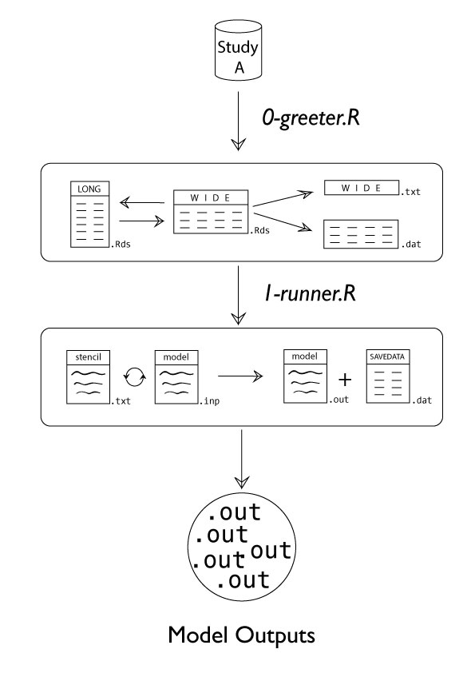

This folder contains scripts for carrying out model estimation using functions provided by the [`IalsaSynthesis`][IalsaSynthesis] package and data prepared by the [ialsa-study-curator] project. 

# Map of Mechanized Estimation

[IalsaSynthesis]:https://github.com/IALSA/IalsaSynthesis/blob/master/README.md
[ialsa-study-curator]:https://github.com/IALSA/ialsa-study-curator/blob/master/README.md